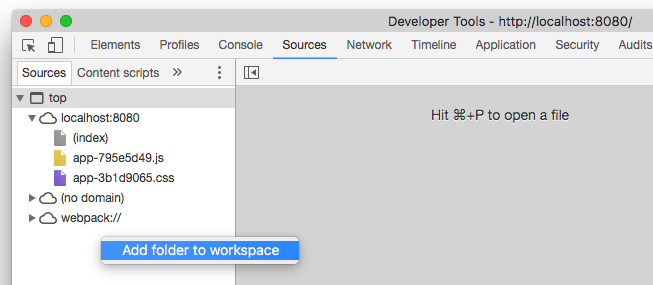
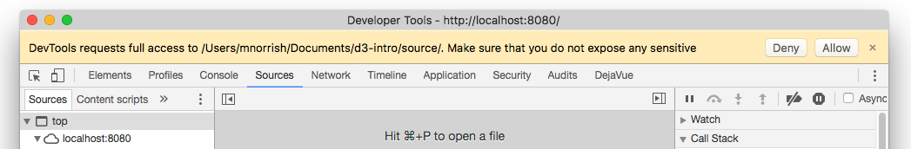
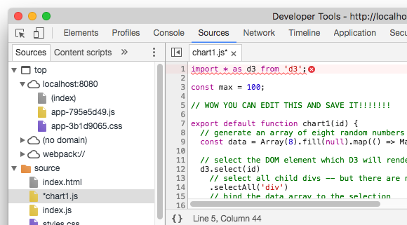

# Introduction to D3

D3 is a JavaScript library for data visualisation.

## Requirements

* Node.js 6.9 or higher
* A modern web browser (Chrome recommended)

## Setup

1. Clone this branch into a directory of your choice
1. `cd` into the directory
1. Run `npm i` to install project dependencies

## Build with development server

_This builds and serves the project with `webpack-dev-server`. It watches for source code changes and reloads automatically._

Run `npm start`

This will serve locally on http://0.0.0.0:8080

## Linking the `source` directory for in-browser editing

_In Chrome:_

1. Open the Sources tab, right click in the sources tree area and select 'Add folder to workspace'
  
1. Select the `sources` directory of this project from your filesystem
1. You may be asked to confirm your permission to add the directory so allow it
  

The `sources` directory should now be listed in the sources tree. You can select and edit the source files.

If you are running the development server any saved changes will be reflected.

## Build to static files

_This builds the project to static files which can be served by any conventional web server. It does not provide the live editing features._

Run `npm run build`

This will build to the `dist` directory.
